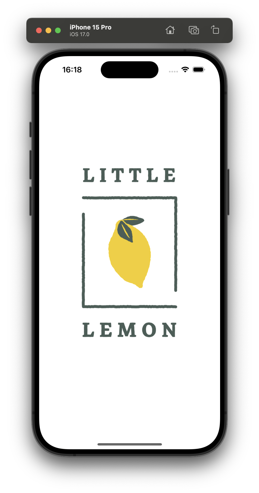
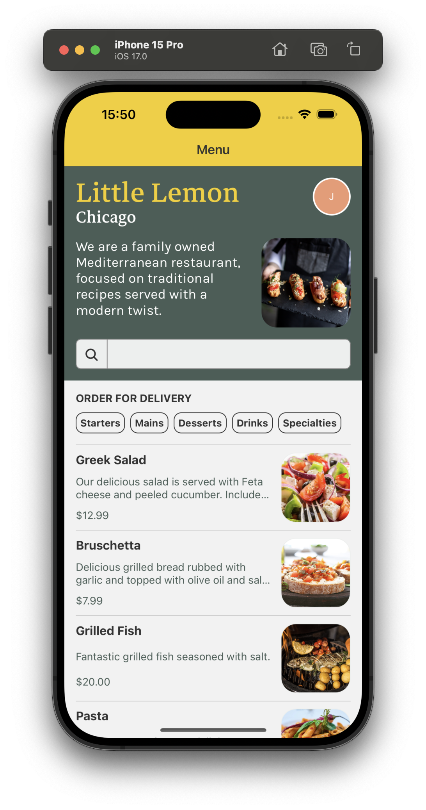
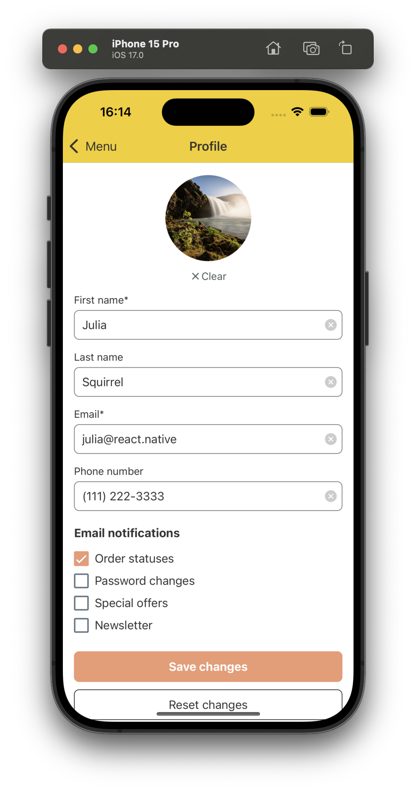

# Little Lemon: Onboarding

## Description
Capstone project for Meta React Native Specialization on Coursera.

## Wireframes
[Wireframes for this project](assets/images/wireframes/wireframes.png) were created with Figma.

 ## Screens

### iOS (Simulator: iPhone 15 Pro, iOS 17.0)

<details>

#### Splash screen



#### Onboarding
<p float="left">
&nbsp; &nbsp; &nbsp; &nbsp;

</p>

#### Menu

<p float="left">
&nbsp; &nbsp; &nbsp; &nbsp;

</p>

#### Profile

<p float="left">
&nbsp; &nbsp; &nbsp; &nbsp;
&nbsp; &nbsp; &nbsp; &nbsp;

</p>

</details>

### Android (Simulator: Google Pixel 3a, Android 14.0)

<details>

#### Splash screen


#### Onboarding
<p float="left">
&nbsp; &nbsp; &nbsp; &nbsp;

</p>

#### Menu

<p float="left">
&nbsp; &nbsp; &nbsp; &nbsp;

</p>

#### Profile

<p float="left">
&nbsp; &nbsp; &nbsp; &nbsp;
&nbsp; &nbsp; &nbsp; &nbsp;

</p>

</details>

## Implementation details
Built with Expo and React Native libraries.

## Build instructions
- clone the repo
```
git clone https://github.com/flngsquirrl/LittleLemonOnboarding.git
```
- install dependencies
```
npm ci
```
- start expo server
```
npx expo start
```
- follow the provided instructions to run the app on a simulator or a device

